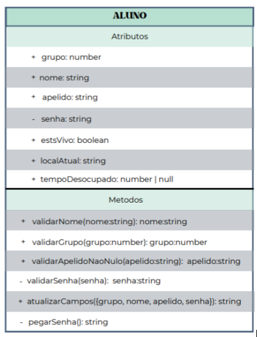

<h1>Projeto BackUs  </h1>

## O que é o BackUs? 🤔

O BackUs é um projeto da disciplina Backend, do curso de Desenvolvimento de Sistemas do SENAI, que tem como objetivo praticar a criação de classes e rotas. Para isso, utilizamos o clássico jogo "Among Us" como base para o desenvolvimento do projeto.

## Divisão do Projeto 📝

O projeto foi dividido em 4 etapas, sendo elas:

1. **Criação do Diagrama de Classe (UML) no Miro:** Nesta etapa, a equipe se reuniu para criar o diagrama de classe do projeto, com o objetivo de organizar as ideias e definir as classes e métodos que seriam implementados.
2. **Criação das Classes:** Nesta etapa, a equipe se dividiu para criar as classes e métodos definidos no diagrama de classe. Cada membro ficou responsável por uma parte do projeto.
3. **Criação das Rotas:** Nesta etapa, a equipe se reuniu para criar as rotas do projeto, com o objetivo de integrar as classes criadas anteriormente.
4. **Example:** Esta etapa ainda não foi realizada.

## Diagrama UML- classe Aluno 📊

Aqui, você pode conferir o diagrama UML da classe Aluno, que foi criado na primeira etapa do projeto:

## Membros do Grupo 🧑‍💻

Aqui, você pode conferir os membros do grupo e suas respectivas atividades em cada etapa do projeto:

<h3 > Mariana Cardoso </h3>

**Etapa 1:** 
 

  - Criação do Diagrama de Classe (UML) no Miro
  - Criação das Classes (Jogo, Dev, Jogador, Mensagem, Sabotador)

- **Etapa 2:**
- Criação das validações (métodos) da classe Aluno
  - validarNome()
  - validarGrupo()
  - validarApelidoNaoNulo()
  - validarSenha()
  - atualizarCampos()
  - pegarSenha()

- **Etapa 3:**
    - Substituiação da classe Aluno pela do professor
    - Criação dos arquivos de rotas
    - Criação das rotas de cadastro
    - Pesquisa sobre a implementação dos métodos e rotas no Postman
    - método **PUT** para atualizar os dados do aluno
    - Revisar e corrigir os métodos de validação
    - Testar no Postman

<h3 > Sophia Gomes </h3 >

- **Etapa 2:**
    - Planejamento e criação da classe Aluno
    - Criação da classe aluno dos seus atributos

- **Etapa 3:**
    - Criação da UML da classe Aluno corrigida
    - Método **GET** para buscar todos os alunos na pasta routes, dentro do arquivo cadastroRoutes.js

<h3 > Maria Eduarda Reis </h3 >

- **Etapa 2:**
    - Planejamento e criação da classe Aluno
    - Criação do UML da classe Aluno

- **Etapa 3**:
    - Criação da UML da classe Aluno corrigida
    - Método **GET** para buscar todos os alunos na pasta routes, dentro do arquivo cadastroRoutes.js

<h3 > Anna Fiochi </h3 >

- **Etapa 2:**
    - Planejamento e criação da classe Aluno
    - Criação da classe aluno dos seus atributos

- **Etapa 3:**
    - Criação da UML da classe Aluno corrigida
    - Método **DELETE** para buscar todos os alunos na pasta routes, dentro do arquivo cadastroRoutes.js

<h3 > Sophia Balico </h3 > 

- **Etapa 2:**
    - Planejamento e criação da classe Aluno
    - Criação do UML da classe Aluno

- **Etapa 3:**
    - Criação da UML da classe Aluno corrigida
    - Ajuda na criação dos métodos de cadastro 
    - Pesquisa sobre a implementação dos métodos e rotas no Postman
    - Método **POST** para buscar todos os alunos na pasta routes, dentro do arquivo cadastroRoutes.js
